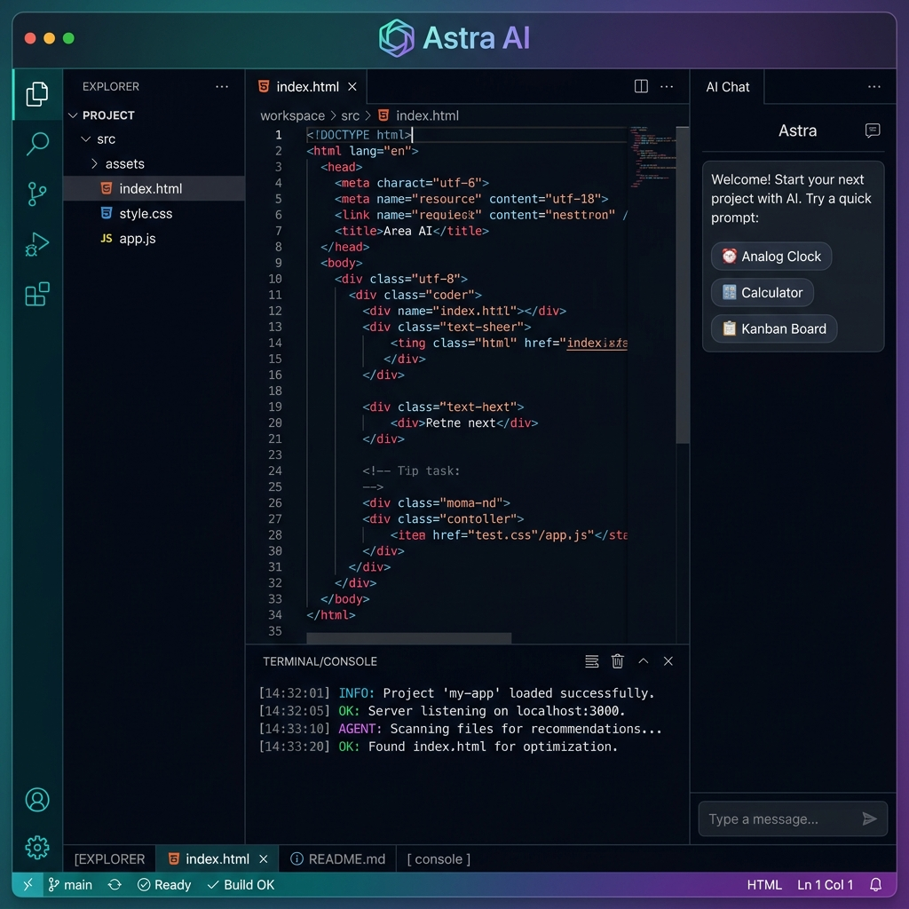
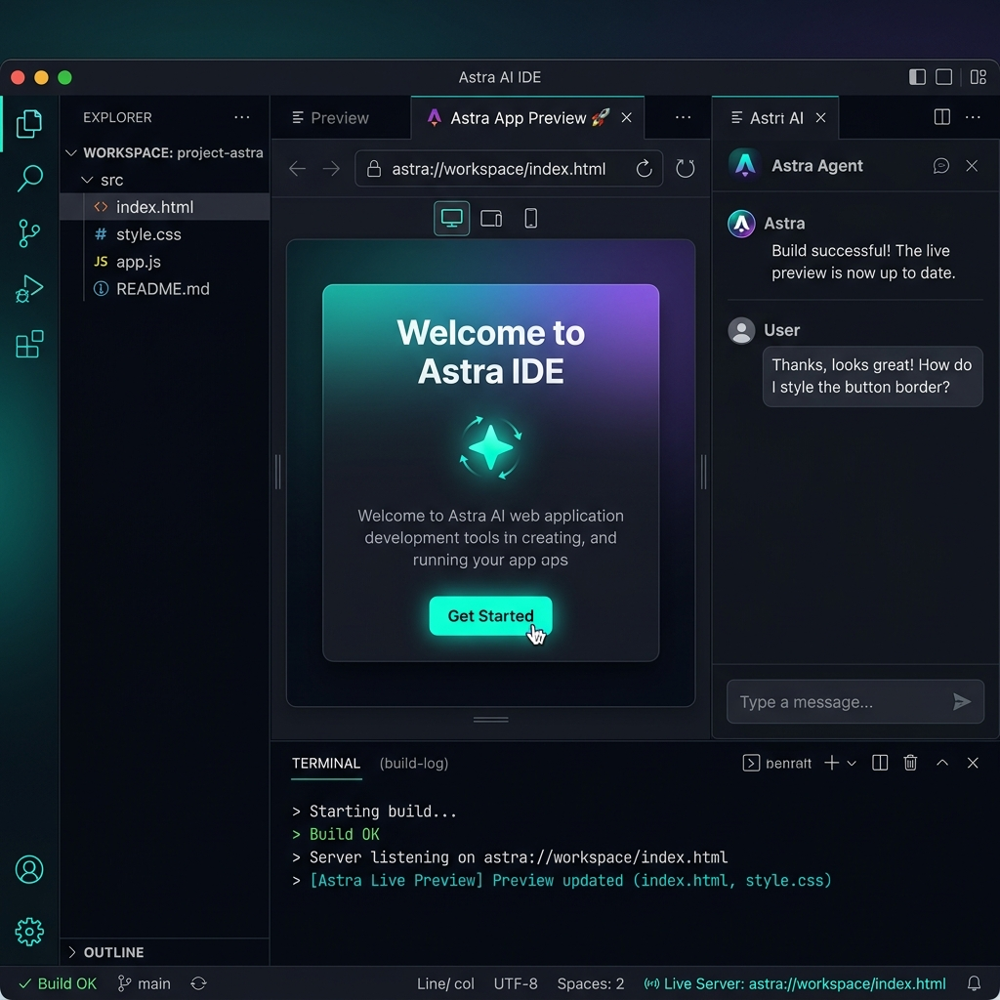
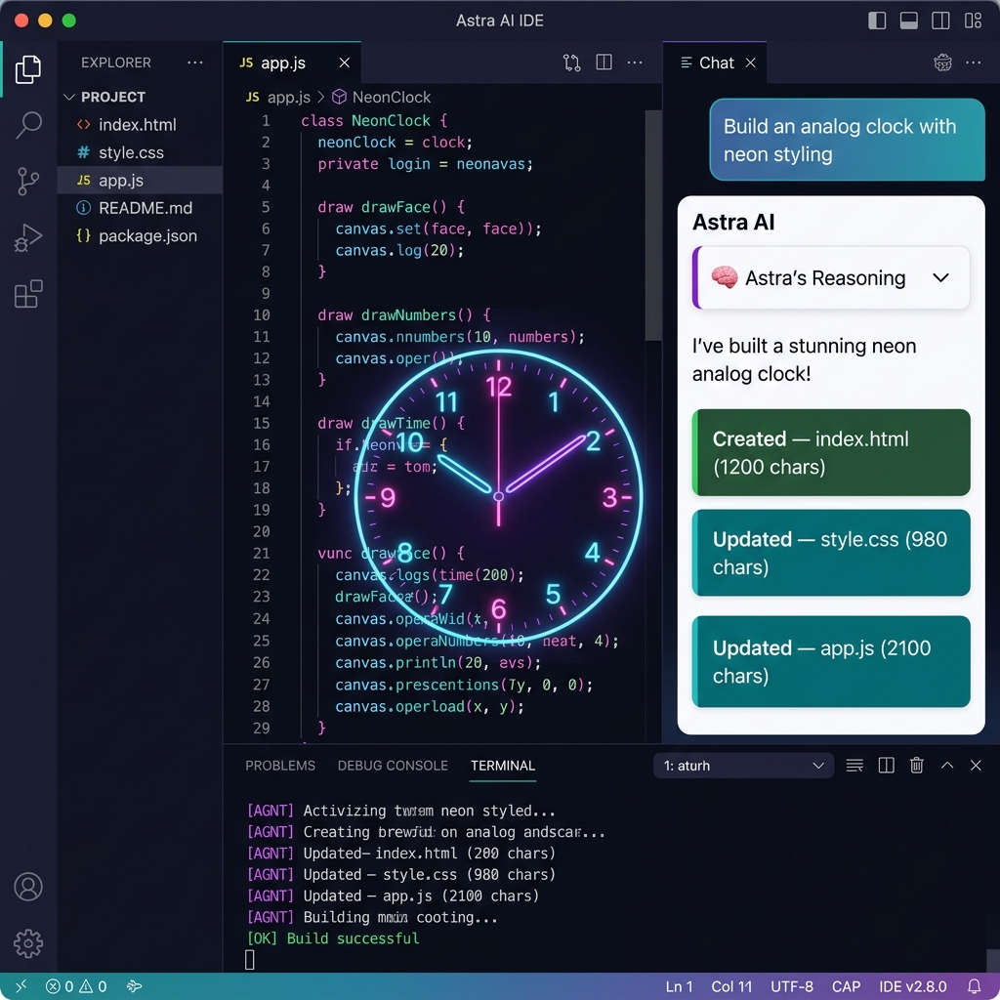
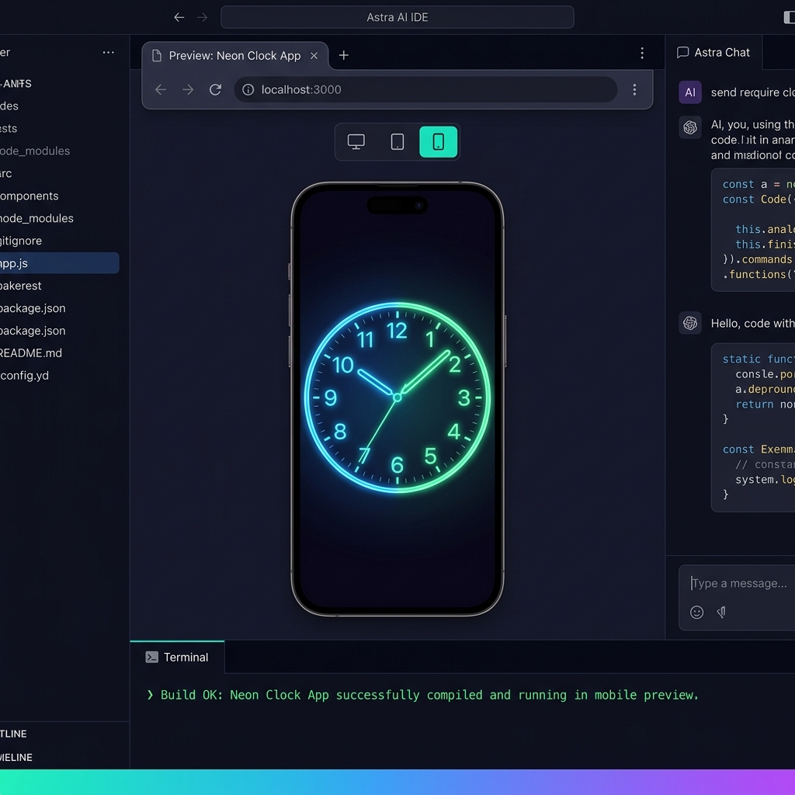

<div align="center">

<svg xmlns="http://www.w3.org/2000/svg" width="72" height="72" viewBox="0 0 32 32" fill="none">
  <path d="M16 2L28 9V23L16 30L4 23V9L16 2Z" stroke="#06b6d4" stroke-width="2" fill="none"/>
  <path d="M16 8L22 12V20L16 24L10 20V12L16 8Z" fill="#8b5cf6" opacity="0.4"/>
  <circle cx="16" cy="16" r="3" fill="#06b6d4"/>
</svg>

# Astra AI IDE

### Autonomous AI Coding Environment · v2.0

[](LICENSE)
[](https://github.com/SatyamPandey07/Astra-AI-IDE)
[](https://microsoft.github.io/monaco-editor/)
[](https://ai.google.dev/)
[](#)

**Astra AI IDE** is a fully browser-based, lightweight AI-powered code editor. Describe any app, and Astra writes the full HTML, CSS, and JavaScript directly into your workspace — then compiles and previews it live, instantly.

No install. No backend. No build step. Just open and build.

[**🚀 Open Live Demo**](http://localhost:8080/index.html) · [**📖 Docs**](#usage) · [**⭐ Star on GitHub**](https://github.com/SatyamPandey07/Astra-AI-IDE)

</div>

---

## 📸 Screenshots

### Full IDE Overview
> Monaco editor with file explorer, terminal console, and AI chat panel



---

### Live Preview Mode
> Instant in-browser compilation with device frame toggles (Desktop / Tablet / Mobile)



---

### Astra AI Agent in Action
> Agent receives a prompt, shows reasoning, writes files, and updates the workspace automatically



---

### Mobile Device Preview Frame
> Test responsive apps in a simulated mobile frame, right inside the IDE



---

## ✨ Features

### 🖥️ IDE Shell
| Feature | Description |
|---|---|
| **Activity Bar** | VS Code–style icon nav — Explorer, Search, Settings, Agent Info |
| **Resizable Panels** | Drag any divider to resize sidebar, terminal, or chat panel |
| **Status Bar** | Live language indicator, cursor Ln/Col, word count, auto-save state |
| **Light / Dark Theme** | Toggle from the activity bar; persists across sessions |
| **Keyboard Shortcuts Modal** | Press the keyboard icon or use `Ctrl+P`/`Ctrl+S` |

### 📁 File Explorer
| Feature | Description |
|---|---|
| **Language Icons** | HTML = orange, CSS = blue, JS = yellow, JSON = green |
| **Dirty File Dots** | `●` indicator on tabs & explorer when file has unsaved changes |
| **Auto-Save** | 2-second debounce auto-saves on every keystroke |
| **Right-click Context Menu** | Rename, Duplicate, or Delete any file |
| **New File / New Folder** | Create files and nested folder placeholders |
| **Global Search** | Search across all VFS files with click-to-navigate results |
| **Quick Open** | `Ctrl+P` fuzzy file switcher |

### ✏️ Monaco Code Editor
| Feature | Description |
|---|---|
| **Monaco v0.44** | Latest Monaco Editor — same engine as VS Code |
| **Bracket Colorization** | Pairs automatically colored for readability |
| **Font Ligatures** | JetBrains Mono with ligature rendering |
| **Smooth Caret Animation** | Fluid cursor movement |
| **`Ctrl+S`** | Save all files and recompile preview |
| **`Ctrl+P`** | Quick Open file switcher |
| **`Ctrl+Shift+P`** | Run Live Preview |
| **`Shift+Alt+F`** | Format Document |
| **Per-file Editor Models** | Each file has its own Monaco model with independent undo history |

### 🖼️ Live Preview
| Feature | Description |
|---|---|
| **Instant Compiler** | DOMParser inlines CSS + JS from VFS into a sandboxed `<iframe>` |
| **Desktop / Tablet / Mobile** | Device frame toggle with hardware chrome borders |
| **Reload Button** | One-click preview refresh |
| **Open in New Window** | Pop the preview out as a standalone browser tab |
| **Fake Address Bar** | `astra://workspace/index.html` for the authentic IDE feel |

### 🖥️ Console & Build Logs
| Feature | Description |
|---|---|
| **Timestamped Lines** | Every log has `HH:MM:SS` prefix |
| **Filter Tabs** | ALL / INFO / WARN / ERROR / AGENT |
| **Copy Logs** | One-click clipboard export |
| **Collapse / Expand** | Toggle the terminal panel to full-screen the editor |

### 🤖 Astra AI Assistant
| Feature | Description |
|---|---|
| **Thought Blocks** | Collapsible accordion showing agent step-by-step reasoning |
| **Typing Indicator** | 3-dot bounce animation while agent responds |
| **File Op Cards** | Visual cards showing Created / Updated / Deleted per file |
| **Quick-start Chips** | 5 one-click demo apps |
| **`↑` Arrow Key** | Recalls last sent prompt |
| **Export Chat** | Download full conversation as `.txt` |
| **Live Gemini API** | Paste your key → connects to `gemini-2.5-flash` live model |
| **Demo Mode** | Works fully offline with 5 built-in app mocks |

---

## ⚡ Quick Start

### 1. Clone & Open

```bash
git clone https://github.com/SatyamPandey07/Astra-AI-IDE.git
cd "Astra-AI-IDE"
```

### 2. Serve Locally

```bash
# Python (built-in)
python3 -m http.server 8080

# OR Node.js
npx serve . -p 8080
```

### 3. Open in Browser

```
http://localhost:8080/index.html
```

> No npm install. No build step. It's pure HTML + CSS + JS.

---

## 🎮 Demo Mode (No API Key Required)

Astra ships with 5 fully built-in demo applications. Just type a prompt and hit Enter:

| Prompt | What Gets Built |
|---|---|
| `Build an analog clock with neon styling` | Canvas-based neon clock with glow effects |
| `Build a calculator app with dark theme` | Glassmorphism calculator with keyboard support |
| `Build a kanban board with drag and drop` | 3-column drag-and-drop project board |
| `Build a markdown preview editor` | Split-pane live markdown editor with toolbar |
| `Build a music player UI with visualizer` | Music player UI with canvas visualizer |

Or click any **Quick Start chip** in the chat panel.

---

## 🔑 Live AI Mode (Gemini API)

For fully custom AI-generated applications:

1. Get a free API key from [Google AI Studio](https://aistudio.google.com/app/apikey)
2. Paste it into the **API Key field** in the top-right header
3. The model badge switches from `Demo Mode` → `Gemini 2.5 Flash`
4. Type any prompt — Astra will generate real multi-file code using live Gemini

> The API key is used client-side and never sent to any third-party server.

---

## ⌨️ Keyboard Shortcuts

| Shortcut | Action |
|---|---|
| `Ctrl+S` | Save all files & recompile preview |
| `Ctrl+P` | Quick Open file switcher |
| `Ctrl+Shift+P` | Run Live Preview |
| `Shift+Alt+F` | Format Document |
| `Ctrl+F` | Find in File |
| `Ctrl+/` | Toggle Line Comment |
| `Ctrl+Z` | Undo |
| `Ctrl+Shift+Z` | Redo |
| `Esc` | Close modals / focus editor |
| `↑` (in chat) | Recall last prompt |

---

## 🏗️ Project Structure

```
Astra-AI-IDE/
├── index.html          # App shell — activity bar, panels, modals, status bar
├── style.css           # Design system — teal/violet tokens, glass panels, animations
├── app.js              # Core logic — VFS, Monaco, compiler, agent, resize, shortcuts
├── screenshots/
│   ├── 01_ide_overview.png
│   ├── 02_live_preview.png
│   ├── 03_agent_chat.png
│   └── 04_mobile_preview.png
└── README.md
```

### Architecture

```
┌─────────────────────────────────────────────────────────┐
│                      TITLEBAR                           │
├──────┬──────────┬──────────────────────┬──────┬────────┤
│      │          │    EDITOR / PREVIEW   │      │        │
│  A   │  SIDEBAR │  ┌─────────────────┐ │  R   │ CHAT   │
│  C   │          │  │  Monaco v0.44   │ │  E   │ PANEL  │
│  T   │ Explorer │  │  or iframe      │ │  S   │        │
│  I   │  Search  │  └─────────────────┘ │  I   │ Astra  │
│  V   │ Settings ├──────────────────────┤  Z   │ Agent  │
│  I   │          │      TERMINAL         │  E   │        │
│  T   │          │  Logs · Filters       │      │        │
│  Y   │          │  Timestamps           │      │        │
├──────┴──────────┴──────────────────────┴──────┴────────┤
│                    STATUS BAR                            │
└─────────────────────────────────────────────────────────┘
```

---

## 🎨 Design System

| Token | Value | Usage |
|---|---|---|
| `--c-teal` | `#06b6d4` | Primary accent, active states |
| `--c-violet` | `#8b5cf6` | Secondary accent, agent UI |
| `--c-emerald` | `#10b981` | Success, build OK |
| `--c-amber` | `#f59e0b` | Warnings, dirty files |
| `--c-rose` | `#f43f5e` | Errors, delete actions |
| `--c-base` | `#050810` | App background |
| `--font-code` | `JetBrains Mono` | Editor, terminal |
| `--font-ui` | `Inter` | All UI text |

---

## 🛣️ Roadmap

- [ ] Multi-tab workspace sessions (localStorage persistence)
- [ ] Git integration panel (diff view, commit, push)
- [ ] NPM package runner (via WebContainers)
- [ ] Extension/plugin system
- [ ] Collaborative editing (WebRTC)
- [ ] Custom themes and color scheme editor
- [ ] Export project as `.zip`
- [ ] Deploy to GitHub Pages directly from IDE

---

## 🤝 Contributing

Pull requests are welcome. For major changes, please open an issue first.

```bash
git clone https://github.com/SatyamPandey07/Astra-AI-IDE.git
cd "Astra-AI-IDE"
# Edit files, serve locally, test
python3 -m http.server 8080
```

---

## 📄 License

MIT © [Satyam Pandey](https://github.com/SatyamPandey07)

---

<div align="center">

Built with ❤️ · Powered by [Monaco Editor](https://microsoft.github.io/monaco-editor/) & [Google Gemini](https://ai.google.dev/)

</div>
